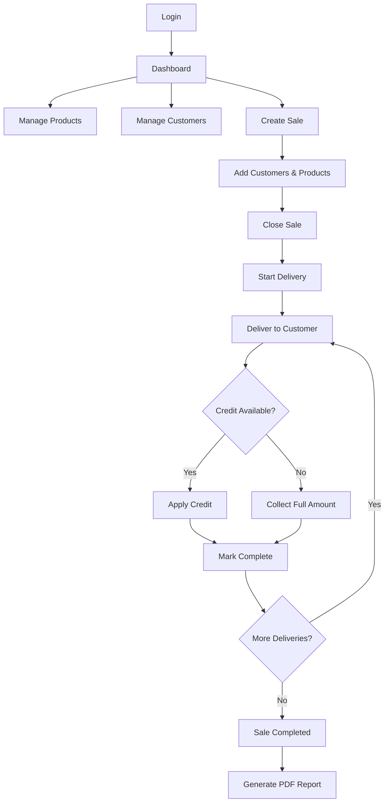

# 🥐 Breakfast Business Frontend

> A modern React frontend for managing a breakfast delivery business - intuitive, responsive, and built for efficiency.

[](https://react.dev/)
[](https://vitejs.dev/)
[](https://developer.mozilla.org/en-US/docs/Web/JavaScript)
[](LICENSE)

---

## 📋 Table of Contents

- [Features](#-features)
- [Tech Stack](#-tech-stack)
- [Getting Started](#-getting-started)
- [Project Structure](#-project-structure)
- [Pages Overview](#-pages-overview)
- [Deployment](#-deployment)

---

## ✨ Features

### 🔐 Authentication
- User signup and login with JWT tokens
- Protected routes with automatic redirects
- Persistent sessions via local storage

### 📦 Product Management
- Create, edit, and delete products
- Track buy and sell prices
- Automatic profit margin calculation

### 👥 Customer Management
- Full CRUD operations for customers
- Store contact info (name, address, phone)
- **Credit System** - Manage pre-paid balances per customer

### 🛒 Sales & Orders
- Create sales with multiple customers and products
- Visual order builder with quantity controls
- Track revenue and profit per sale
- Sale lifecycle management (Draft → Closed → In Progress → Completed)

### 🚚 Delivery Management
- **Real-time progress tracking** - Live updates via Server-Sent Events
- **Smart routing** - Drag-and-drop to reorder delivery sequence
- **Flexible status** - Mark as delivered, skip with reason, or reset
- **Credit Integration** - Automatic credit application during delivery:
  - Shows credit balance for each customer
  - Calculates amount to collect after credit
  - Displays "Fully covered by credit" when applicable
  - Tracks credit applied in completed deliveries

### 💳 Credit System
- View and edit customer credit balances
- Automatic application during delivery completion
- Visual indicators showing credit impact on payments
- Full audit trail in delivery history

### 🌐 Public Customer Portal
- Unique access links for each customer per sale
- Self-service order modification
- Real-time delivery status updates
- Credit visibility and payment calculation

### 📊 Analytics & Reports
- **PDF Reports** - Detailed sale reports with:
  - Summary with expected vs actual revenue
  - Credit applied totals
  - Per-customer breakdown with products
  - Product summary with costs
- Profit calculations including credit as revenue

### 🌍 Localization
- Multi-language support
- Date and currency formatting

---

## 🛠 Tech Stack

| Technology | Purpose |
|------------|---------|
| **React 18** | UI component library |
| **Vite** | Fast build tool and dev server |
| **React Router** | Client-side routing |
| **jsPDF** | PDF report generation |
| **CSS3** | Custom dark theme styling |
| **SSE** | Real-time delivery updates |

---

## 🚀 Getting Started

### Prerequisites

- Node.js 18 or higher
- npm or yarn
- Backend API running (see [breakfast-backend](../breakfast-backend))

### Installation

1. **Clone the repository**
   ```bash
   git clone https://github.com/yourusername/breakfast-frontend.git
   cd breakfast-frontend
   ```

2. **Install dependencies**
   ```bash
   npm install
   ```

3. **Configure environment**
   ```bash
   cp .env.example .env
   # Edit .env with your API URL
   ```

4. **Start development server**
   ```bash
   npm run dev
   ```

5. **Open in browser**
   ```
   http://localhost:5173
   ```

### Environment Variables

```bash
# API Configuration
VITE_API_URL=http://localhost:8000
```

---

## 📁 Project Structure

```
breakfast-frontend/
├── public/                    # Static assets
├── src/
│   ├── components/           # Reusable components
│   │   ├── Header.jsx        # Navigation header
│   │   ├── ProtectedRoute.jsx # Auth guard
│   │   └── ...
│   ├── pages/                # Page components
│   │   ├── Login.jsx         # Authentication
│   │   ├── Products.jsx      # Product management
│   │   ├── Customers.jsx     # Customer management
│   │   ├── Sales.jsx         # Sales list
│   │   ├── SaleForm.jsx      # Create/edit sales
│   │   ├── SaleView.jsx      # Sale details & PDF
│   │   ├── DeliveryView.jsx  # Delivery management
│   │   └── CustomerOrder.jsx # Public order page
│   ├── services/
│   │   └── api.js            # API client
│   ├── utils/
│   │   ├── pdfGenerator.js   # PDF utilities
│   │   └── salePDF.js        # Sale report PDF
│   ├── i18n/                 # Translations
│   ├── App.jsx               # Root component
│   ├── App.css               # Global styles
│   └── main.jsx              # Entry point
├── .env                      # Environment config
├── package.json              # Dependencies
├── vite.config.js            # Vite configuration
└── README.md                 # This file
```

---

## 📱 Pages Overview

### Admin Pages (Protected)

<details>
<summary><b>Products</b></summary>

- List all products with buy/sell prices
- Add new products with validation
- Edit existing products inline
- Delete with confirmation
</details>

<details>
<summary><b>Customers</b></summary>

- List all customers with contact info
- Manage credit balances
- Generate unique order access links
- Edit/delete customer records
</details>

<details>
<summary><b>Sales</b></summary>

- View all sales with status indicators
- Filter by date and status
- Quick actions (view, edit, delete)
- Navigate to delivery management
</details>

<details>
<summary><b>Sale Form</b></summary>

- Select customers for the sale
- Add products with quantities
- Real-time total calculation
- Save as draft or close immediately
</details>

<details>
<summary><b>Delivery View</b></summary>

- Current delivery with full details
- Credit information and amount to collect
- Complete/skip buttons with validation
- Pending deliveries queue
- Completed deliveries history
- Real-time SSE updates
</details>

### Public Pages

<details>
<summary><b>Customer Order</b></summary>

- Access via unique token link
- View available products
- Modify order quantities
- See credit balance and amount to pay
- Real-time delivery status tracking
</details>

---

## 🎨 Theming

The application uses a custom dark theme with:

- **Primary colors**: Warm browns and oranges (`#d4a574`, `#e07a5f`)
- **Accent colors**: Soft blues and greens (`#81b3d0`, `#7fb069`)
- **Background**: Dark grays (`#1a1a2e`, `#16213e`)
- **Text**: High contrast whites and grays

---

## 🌐 Deployment

### Build for Production

```bash
npm run build
```

The built files will be in the `dist/` directory.

### Deploy to Render

<details>
<summary><b>Static Site Deployment</b></summary>

1. Create a new Static Site in Render
2. Connect your GitHub repository
3. Configure:
   - **Build Command**: `npm install && npm run build`
   - **Publish Directory**: `dist`
4. Add environment variables
5. Add redirect rule: `/* → /index.html` (for SPA routing)
</details>

### Deploy to Vercel

<details>
<summary><b>Vercel Deployment</b></summary>

1. Install Vercel CLI
   ```bash
   npm install -g vercel
   ```

2. Deploy
   ```bash
   vercel
   ```

3. Set environment variables in Vercel dashboard
</details>

### Deploy to Netlify

<details>
<summary><b>Netlify Deployment</b></summary>

1. Create `netlify.toml`:
   ```toml
   [build]
     command = "npm run build"
     publish = "dist"

   [[redirects]]
     from = "/*"
     to = "/index.html"
     status = 200
   ```

2. Connect repository in Netlify dashboard
3. Set environment variables
</details>

---

## 🔄 Workflow



---

## 📄 License

This project is licensed under the MIT License - see the [LICENSE](LICENSE) file for details.

---

<div align="center">

**Built with React and lots of ☕**

</div>
